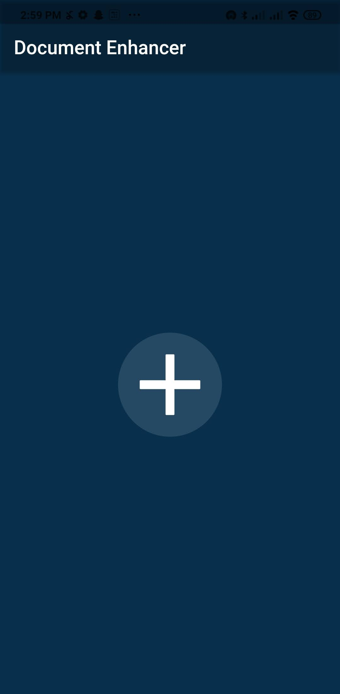

# Document-Enchancer
* This app basically an App which can be used to detect documents using Images or you can even Capture the image from your phone's camera. And further we will be calling a API call which is built in python to enhance the image using machine learning and Python Image Library.
* There are three option for the user where the Camera and Gallery option automates everything for the user from cropping the image to enhancing the image where as from the last option user is given everything to do from adjusting the edges to edit the image.

# Screenshots:
 
