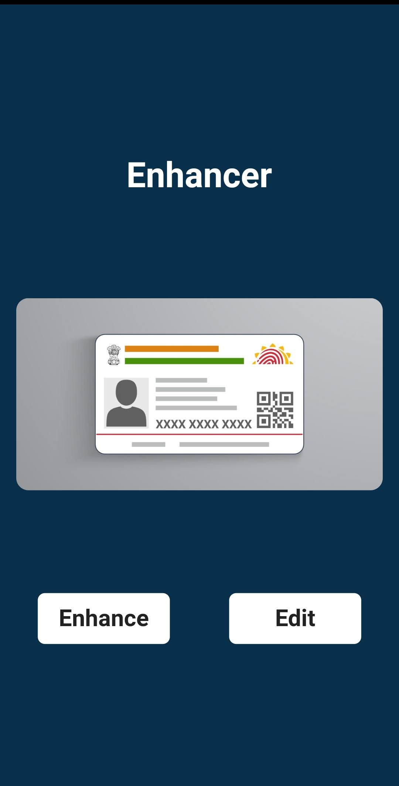

# Document-Enchancer ft.Netflix_and_Chill
* Document Enhancer is basically an Application which can be used to detect documents using Images as well as by Capturing the image from the user's mobile camera.                
* There are three options for the user where the first two options are; Camera and Gallery which automate everything for the user from cropping the image to enhancing the image. Whereas the third option is more of a munnual option, where the user can do everything by themselves from adjusting the edges to editing the image.
* The application has another inbuilt feature which enhances the image quality. And this entire enhancing process will take place when we will be making an API call which is built in python to enhance the image using machine learning and Python Image Library.

# Screenshots:

